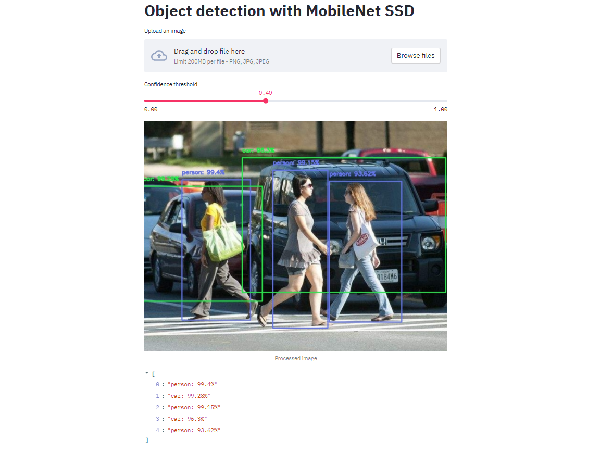

# Object Detection with MobileNet SSD
Simple object detection app with streamlit. Upload an image and perform object detection. Adjust the confidence threshold to see how this affects predictions.

## MobileNet SSD
The mobilenet-ssd model is a Single-Shot multibox Detection (SSD) network intended to perform object detection. This model is implemented using the Caffe* framework.
